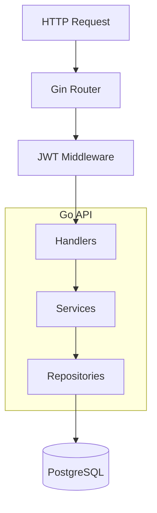
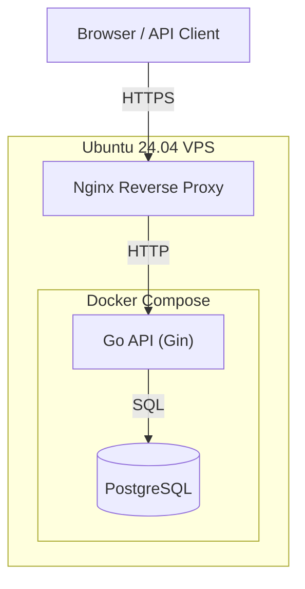

# RiffLog

RiffLog is a backend web service that helps guitar players record and analyze their practice sessions. Users can register accounts, securely authenticate with JWTs, log practice sessions, browse practice skills, and review practice statistics over time.

I built RiffLog as the capstone project in my journey back into professional software development. The goal wasn't simply to create another CRUD API—it was to design, build, test, and deploy a complete backend service using modern Go development practices.

I intentionally built RiffLog without using an ORM or code-generation tools because I wanted to deepen my understanding of SQL, PostgreSQL, HTTP APIs, authentication, and backend architecture. Every layer of the application—from middleware to database queries—was implemented manually to strengthen my understanding of how modern backend services are constructed.

## Live Deployment

| Resource          | URL                                 |
| ----------------- | ----------------------------------- |
| Live API          | https://api.rifflog.scottstarks.dev |
| API Documentation | [docs/api.md](docs/api.md)          |

---

## Screenshots

### API Documentation


### Live HTTPS Endpoint


## Core Features

### Authentication

- User registration
- Secure password hashing with bcrypt
- JWT-based authentication
- Protected API endpoints
  
### Practice Sessions

- Create, update, and delete practice sessions
- Filter sessions by skill and date range

### Statistics

* Total practice time
* Session count
* Most practiced skill
* Longest session

---

## Project Architecture

The application follows a layered architecture to separate HTTP concerns, business logic, and data persistence.



Responsibilities are separated into:

* **Handlers** – Parse HTTP requests and build HTTP responses.
* **Services** – Implement business rules and validation.
* **Repositories** – Execute SQL queries and map database results.
* **Middleware** – Authenticate requests and populate the authenticated user context.

---

## Project Structure

```text
cmd/
    API entry point

internal/
    auth/
    handlers/
    middleware/
    models/
    repository/
    services/

migrations/

docs/

images/
```

---

## Technology Stack

| Technology     | Purpose                       |
| -------------- | ----------------------------- |
| Go 1.25        | Backend language              |
| Gin            | HTTP routing and middleware   |
| PostgreSQL 17  | Relational database           |
| pgx            | PostgreSQL driver             |
| Docker Compose | Local development environment |
| JWT            | Authentication                |
| bcrypt         | Password hashing              |
| golang-migrate | Database migrations           |
| Nginx          | Reverse Proxy                 |
| Let's Encrypt  | HTTPS                         |
| DigitalOcean   | Hosting                       |

---

## Deployment



---

## Getting Started

### Prerequisites

* Go
* Docker Desktop
* PostgreSQL (via Docker Compose)
* golang-migrate CLI

### About development workflow

During development, PostgreSQL runs in Docker while the Go API is run directly from the local development environment. This provides a consistent database environment while allowing fast compilation, debugging, and testing of the Go application.

### 1. Clone the repository

```bash
git clone https://github.com/thetramp22/rifflog.git
cd rifflog
```

### 2. Configure environment variables

```bash
cp .env.example .env
cp .env.test.example .env.test
```

Update the values in `.env` to match your local environment.

### 3. Start the database

```bash
docker compose up --build -d
```

### 4. Run database migrations

Run the migrations using the same database credentials configured in your `.env` file.

```bash
migrate \
  -path migrations \
  -database "postgres://<DB_USER>:<DB_PASSWORD>@localhost:<DB_PORT>/<DB_NAME>?sslmode=disable" \
  up
```

### 5. Start the API

Docker Compose starts PostgreSQL for local development. The API is run directly from the Go toolchain to provide faster build and debugging during development.

```bash
go run ./cmd/api
```

---

## Running Tests

Run all tests:

```bash
go test ./...
```

---

## API Documentation

Complete API documentation is available in:

```text
docs/api.md
```

The documentation includes:

* Request and response examples
* Authentication requirements
* Query parameters
* Path parameters
* Error responses

---

## Design Decisions

Several design decisions were intentionally made while developing this project:

* JWT authentication is handled through dedicated middleware rather than requiring client-supplied user IDs.
* Repository methods are responsible for translating database-specific behavior into application-level errors.
* Context is propagated through the service and repository layers using Go's standard `context.Context`.
* Practice session ownership is enforced at the database query level to prevent users from accessing or modifying another user's data.
* SQL queries are written directly rather than using an ORM to demonstrate familiarity with relational database design and PostgreSQL.

---

## Roadmap

Planned Features:

* React frontend
* User-defined skills
* CI/CD pipeline
  
Possible Improvements:

* Refresh token support
* Password reset workflow
* OpenAPI (Swagger) documentation
* Pagination for large result sets
* Practice goals and streak tracking

---

## Motivation

I learned to play guitar when I was young, but as life became busier with work, family, and other responsibilities, I found it difficult to make time to practice. Years later, I wanted to return to playing but realized I had lost much of the technique and muscle memory I once had. RiffLog began as a way to bring structure and consistency back into my practice routine.

---

## What I Learned

The biggest lesson from this project was learning how individual backend concepts fit together into a complete system. Building the API required much more than implementing endpoints; it involved designing layered application architecture, securing requests with JWT authentication, structuring SQL repositories, writing integration tests, containerizing the application with Docker, and ultimately deploying it to a Linux VPS behind an Nginx reverse proxy with HTTPS. Seeing all of those pieces work together transformed many concepts that had previously felt isolated into a cohesive understanding of how production backend services are built and operated.

---

## Challenges

Building RiffLog involved more than implementing REST endpoints. Along the way I encountered and solved a number of real-world engineering problems, including:

- Designing a layered architecture that remained easy to test and extend.
- Securing endpoints with JWT authentication while keeping authorization centralized in middleware.
- Managing PostgreSQL schema evolution through versioned database migrations.
- Containerizing the application with Docker Compose for consistent development and deployment.
- Deploying the application to a Linux VPS behind an Nginx reverse proxy with HTTPS certificates issued by Let's Encrypt.

---

## License

This project is available under the MIT License.