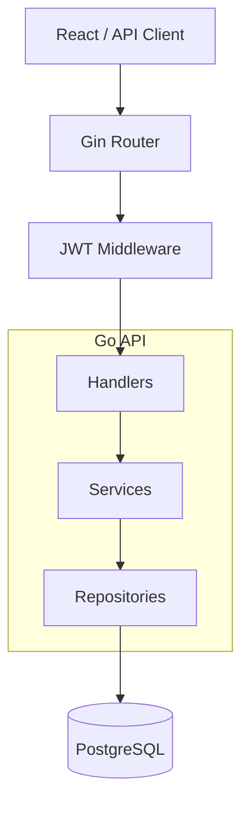
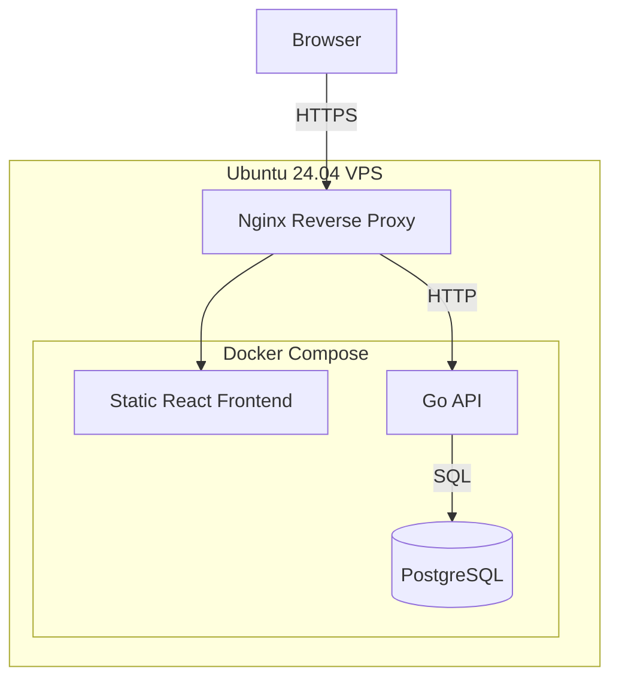

# RiffLog

RiffLog is a full-stack web application for tracking and analyzing guitar practice sessions. Users can create an account, securely authenticate, log practice sessions, browse available practice skills, and review statistics about their practice over time.

The project was built as a portfolio project to demonstrate the design, implementation, testing, and deployment of a complete web application, with particular emphasis on backend development in Go.

## Live Application

- **Application:** https://rifflog.scottstarks.dev
- **API:** https://api.rifflog.scottstarks.dev
- **API Documentation:** [docs/api.md](docs/api.md)
- **Frontend Repository:** https://github.com/thetramp22/rifflog-ui

## What This Project Demonstrates

RiffLog was intentionally built to demonstrate practical software development skills rather than simply produce a collection of isolated features.

The project demonstrates:

- Building a REST API with Go and Gin
- Designing a layered backend architecture
- Working directly with PostgreSQL and SQL
- Implementing authentication and authorization
- Writing unit and integration tests
- Managing database schema changes with migrations
- Containerizing services with Docker and Docker Compose
- Building a React/TypeScript frontend
- Deploying an application to a Linux VPS
- Configuring Nginx as a reverse proxy
- Serving the application over HTTPS
- Connecting a frontend and backend across production environments

## Features

### Authentication

- User registration
- Secure password hashing with bcrypt
- JWT-based authentication
- Protected API endpoints
- Server-side user identification from authenticated requests

### Practice Sessions

- Create, update, and delete practice sessions
- View practice history
- Filter sessions by skill and date range
- Associate each session with a practice skill
- Store optional practice notes

### Practice Statistics

The API calculates aggregate statistics for the authenticated user, including:

- Total practice time
- Total number of sessions
- Most practiced skill by total minutes
- Longest practice session

### Frontend

The React/TypeScript frontend provides:

- User registration and login
- Protected application routes
- Dashboard with practice statistics
- Practice-session creation and management
- Session filtering
- Responsive navigation and layout
- Error handling for authentication and API failures

## Architecture

RiffLog uses a layered backend architecture to separate HTTP concerns, application logic, and database access.


```mermaid
flowchart TD
    Client["React / API Client"]
    Router["Gin Router"]
    Middleware["JWT Middleware"]

    subgraph Backend["Go API"]
        Handlers["Handlers"]
        Services["Services"]
        Repositories["Repositories"]
    end

    Database[("PostgreSQL")]

    Client --> Router
    Router --> Middleware
    Middleware --> Handlers
    Handlers --> Services
    Services --> Repositories
    Repositories --> Database
```

### Backend Responsibilities

- **Handlers** — Parse HTTP requests, validate request data, and build HTTP responses.
- **Services** — Implement application behavior, validation, and business rules.
- **Repositories** — Execute SQL queries and translate database results into application models.
- **Middleware** — Authenticate requests and make the authenticated user available to protected handlers.
- **Models** — Represent application and request/response data structures.

The application intentionally does not use an ORM or code-generation tool. SQL queries are written directly so that database behavior remains explicit and the project demonstrates familiarity with PostgreSQL and relational data access.

## Deployment Architecture

The production application is deployed to an Ubuntu 24.04 VPS.


```mermaid
flowchart TD
    Browser["Browser"]

    subgraph VPS["Ubuntu 24.04 VPS"]
        Nginx["Nginx Reverse Proxy"]

        subgraph Docker["Docker Compose"]
            Frontend["Static React Frontend"]
            API["Go API"]
            DB[("PostgreSQL")]
        end
    end

    Browser -->|"HTTPS"| Nginx
    Nginx --> Frontend
    Nginx -->|"HTTP"| API
    API -->|"SQL"| DB
```

The frontend is served as static files by Nginx. API requests are reverse-proxied to the Go application running in Docker, while PostgreSQL runs as a separate Docker Compose service.

HTTPS is provided through Let's Encrypt.

## Technology Stack

| Technology | Purpose |
| --- | --- |
| Go 1.25 | Backend language |
| Gin | HTTP routing and middleware |
| PostgreSQL 17 | Relational database |
| pgx | PostgreSQL driver |
| golang-migrate | Database migrations |
| JWT | Authentication |
| bcrypt | Password hashing |
| Docker | Containerization |
| Docker Compose | Local development and deployment |
| React | Frontend UI |
| TypeScript | Frontend language |
| React Router | Frontend routing |
| MUI | Frontend component library |
| Nginx | Reverse proxy and static file server |
| Let's Encrypt | HTTPS |
| Ubuntu 24.04 | Production server |

## Project Structure

```text
cmd/
    api/
        main.go

internal/
    auth/
    bootstrap/
    config/
    database/
    handlers/
    middleware/
    models/
    repositories/
    services/

migrations/

docs/
    api.md

images/
```

The frontend is maintained in a separate repository:

```text
thetramp22/rifflog-ui
```

## Getting Started

### Prerequisites

- Go 1.25 or later
- Docker Desktop
- Docker Compose
- golang-migrate CLI

### 1. Clone the repository

```bash
git clone https://github.com/thetramp22/rifflog.git
cd rifflog
```

### 2. Configure environment variables

```bash
cp .env.example .env
cp .env.test.example .env.test
```

Update `.env` with values appropriate for the local development environment.

The application uses environment variables for database configuration, the JWT signing secret, application port, and allowed CORS origins.

### 3. Start PostgreSQL

```bash
docker compose up --build -d postgres
```

### 4. Run database migrations

Run the migrations using the database credentials configured in `.env`.

```bash
migrate \
  -path migrations \
  -database "postgres://<DB_USER>:<DB_PASSWORD>@localhost:<DB_PORT>/<DB_NAME>?sslmode=disable" \
  up
```

### 5. Start the API

The development workflow runs PostgreSQL in Docker while running the Go API directly from the local Go toolchain. This provides a consistent database environment while allowing fast compilation, debugging, and testing.

```bash
go run ./cmd/api
```

The API will listen on port `8080` by default.

## Running Tests

Run the complete test suite with:

```bash
go test ./...
```

The project includes unit and integration tests covering authentication, middleware, handlers, database interactions, and API behavior.

## API Documentation

Complete API documentation is available in [docs/api.md](docs/api.md).

The API documentation includes:

- Available endpoints
- Authentication requirements
- Request bodies
- Query and path parameters
- Example responses
- Error responses
- Filtering behavior

## Security and Authorization

Authentication uses JSON Web Tokens issued during login. Protected routes require a valid Bearer token.

The server derives the authenticated user's ID from the JWT rather than accepting a client-supplied user ID.

Practice-session queries also include the authenticated user's ID when reading, updating, or deleting resources. This means authorization is enforced as part of the database operation rather than relying solely on application-level checks.

Passwords are stored using bcrypt hashes rather than plaintext credentials.

## Design Decisions

Several implementation decisions were made deliberately during development:

- **Layered architecture:** Handlers, services, and repositories have separate responsibilities so that HTTP, application, and persistence concerns remain decoupled.
- **Direct SQL:** PostgreSQL queries are written directly rather than through an ORM to strengthen understanding of SQL and relational database behavior.
- **Repository abstraction:** Database-specific behavior is kept within repository methods rather than leaking into handlers or services.
- **Context propagation:** `context.Context` is passed through the service and repository layers for request-scoped operations.
- **JWT middleware:** Authentication is centralized in middleware so protected handlers can work with an authenticated user context.
- **Ownership enforcement:** Database queries use the authenticated user's ID when operating on practice sessions, preventing users from accessing or modifying another user's data.

## Testing and Reliability

Testing was treated as part of the development process rather than a final step.

The backend test suite includes coverage for:

- JWT generation and validation
- Authentication middleware
- HTTP handlers
- Database-backed integration behavior
- Practice-session CRUD operations
- Filtering
- Statistics
- Error handling

The deployed application was also tested end-to-end through the production frontend, including authentication, dashboard statistics, session creation, editing, filtering, and deletion.

## Development and Deployment

Local development and production use the same core application architecture while separating development concerns from the production environment.

During local development:

- PostgreSQL runs in Docker
- The Go API runs directly from the Go toolchain
- Database migrations are run against the local PostgreSQL instance

In production:

- The application runs on an Ubuntu VPS
- Docker Compose manages the API and PostgreSQL services
- Nginx serves the frontend and reverse-proxies API requests
- HTTPS is provided by Let's Encrypt

## Challenges and Lessons Learned

Building RiffLog provided experience with the integration points between individual backend concepts and a complete deployed application.

Major challenges included:

- Designing a layered architecture that remained easy to test and extend
- Implementing JWT authentication and protected resources
- Enforcing resource ownership correctly
- Managing PostgreSQL schema changes with migrations
- Writing integration tests against a real database
- Containerizing the backend and database
- Configuring a Linux VPS for production deployment
- Setting up Nginx as a reverse proxy
- Configuring HTTPS and CORS for a separately hosted frontend
- Connecting a React frontend to the deployed API

The project reinforced that building a backend service involves more than implementing endpoints: database design, authentication, testing, deployment, networking, and operational concerns all become part of the application.

## Motivation

RiffLog began as a way to bring structure and consistency back to guitar practice. The project grew into a larger software-development project as I used it to apply the backend concepts I was learning and build something representative of the kind of software I want to develop professionally.

## License

This project is available under the MIT License.
